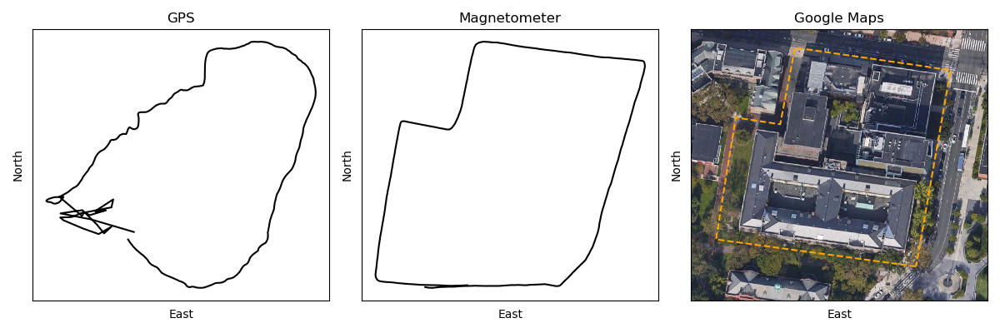

## Dead reckoning

Here we implement a simple navigation algorithm using yaw attitude data obtained from a smartphone. We compare our estimated trajectory with GPS. Requires `numpy` and `imageio`.

