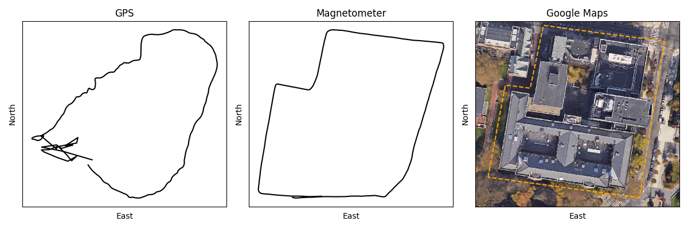

## Dead reckoning

Here we use path integration on real yaw attitude 
time series data gathered on the UPenn campus 
from the magnetometer on a smartphone. We 
compare how the estimated trajectory differs 
from a GPS estimate.

We find that dead reckoning produces extremely 
reliable position estimates. To further improve 
performance, it is possible to combine GPS 
and dead reckoning. We can periodically correct 
our dead reckoning estimates 
(which have a tendency to drift) using GPS 
(which is correct on average). A complementary 
filter can be used for this purpose. 

